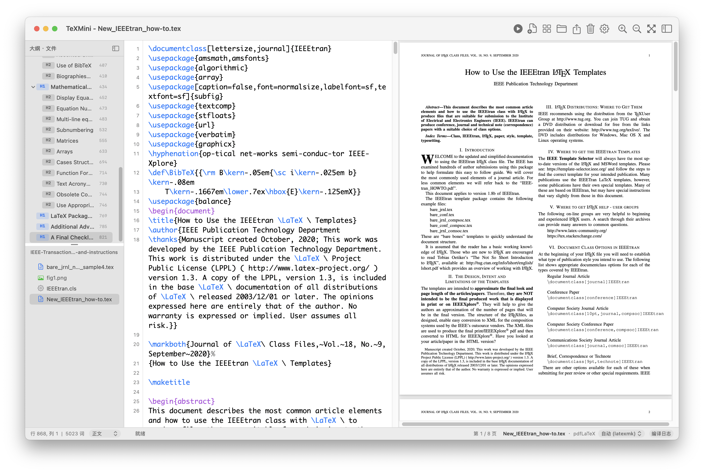

# TeXMini

轻量的 macOS 原生 LaTeX 编辑器，使用 Objective-C、AppKit 和 PDFKit。左侧写作，右侧预览 PDF；支持语法高亮、大纲、文件侧栏、补全、错误行跳转和 SyncTeX 双向定位。

## 界面预览



左侧通过大纲和文件列表快速定位章节与项目文件，中间编辑 LaTeX 源码，右侧查看编译后的 PDF。底部显示文档信息、编译引擎和日志入口，在同一窗口完成写作、编译与预览。

## 下载与安装

从 [GitHub Releases 下载最新版](https://github.com/codesun981/TeXMini/releases/latest)，最低要求 **macOS 14**。Apple Silicon Mac 选择文件名含 `arm64` 的安装包，Intel Mac 选择含 `x86_64` 的安装包。两种架构分别构建，不是 Universal 二进制。

下载 `.dmg` 后打开，将 TeXMini 拖入 Applications；也可下载 `.zip`，解压后将 `TeXMini.app` 移入“应用程序”。`SHA256SUMS.txt` 提供安装包的 SHA-256 校验值。

发行包使用临时签名，尚未经过 Developer ID 签名及 Apple 公证。首次打开若被 macOS 阻止，请在确认下载来自本仓库后，前往“系统设置 → 隐私与安全性”，找到 TeXMini 的提示并选择“仍要打开”。无需关闭系统的安全检查。

Apple Silicon 版本已在本机完成构建与自动化测试；Intel 版本由 CI 构建并校验，尚未进行 Intel 实机运行验证。

## 环境

- macOS 14 或更新版本。
- 构建需要 Xcode Command Line Tools（`xcode-select --install`）。无需 Xcode 工程或第三方运行时。
- 编译 LaTeX 需要单独安装 [MacTeX](https://www.tug.org/mactex/) 或提供相应引擎的 TeX 发行版。推荐包含 `latexmk` 的发行版，以自动处理多遍编译和参考文献。中文模板需要 XeLaTeX 与 `ctex`。

TeXMini 不附带 TeX 发行版。程序优先查找 `/Library/TeX/texbin`，也支持常见安装目录和 `PATH`。

## 构建与运行

```sh
./build.sh
open build/TeXMini.app
```

构建产物为 `build/TeXMini.app`，默认生成当前机器架构的版本（Apple Silicon 为 arm64，Intel 为 x86_64），不是 Universal 二进制。脚本明确设置 macOS 14 最低版本，支持增量构建；编译选项变化会使旧对象文件失效。

```sh
make test       # 单元、编译集成与无窗口的控制器流程测试
make install    # 构建并替换 /Applications/TeXMini.app
```

未安装 `latexmk` 时，编译集成测试会显示跳过。开发构建使用本机临时签名，未经过 Developer ID 签名及 Apple 公证。

维护者可运行 `make package` 生成当前机器架构的 ZIP、DMG 和 `SHA256SUMS.txt`，输出位于 `build/releases/`。版本与构建号读取自 `resources/Info.plist`。脚本在隔离目录中调用 `build.sh` 全新构建，仅打包应用；新增、移动或删除源码和资源后，需先更新 Git 索引。

## 使用

打开 `.tex` 文件或项目文件夹即可编辑。编译目标会按 `% !TEX root`、文档类及文件引用推断；多主文件项目建议在子文件头部明确指定 `% !TEX root = ../main.tex`。

| 操作 | 快捷键 |
| --- | --- |
| 保存并编译 | ⌘↩ |
| 取消编译 | ⌘. |
| 清理并重新编译 | ⌥⌘↩ |
| 保存 / 另存为 | ⌘S / ⇧⌘S |
| 查找 / PDF 查找 | ⌘F / ⇧⌘F |
| 注释 / 取消注释 | ⌘/ |
| 源码跳转至 PDF | ⌘J |

自动保存、停止输入后自动编译及恢复上次会话可在偏好设置中调整。编译中间文件默认按主文件完整路径隔离到 `~/Library/Caches/TeXMini/build/`；PDF 默认写到源文件旁。额外参数中的 `-outdir`、`-auxdir`、`-jobname` 会同时用于编译和产物定位。

新文档使用 UTF-8。已有文件保留可识别的编码；旧编码文件建议在文件起始的注释头中声明，例如 `% !TEX encoding = GBK`，也支持 `inputenc` 的编码声明。不能可靠识别或不能无损保存时会提示错误，避免将乱码写回源文件。将声明改成 UTF-8 后保存可进行无损转换。

## 贡献与许可

逻辑改动添加回归测试，界面改动构建后人工验证；不引入第三方运行时。编译功能使用 `src/Services/`，编辑界面使用 `src/Views/`；`build.sh` 自动收集 `src` 下的 `.m` 文件。

TeXMini 采用 [MIT 许可](LICENSE)。SyncTeX 解析器由 Jérôme Laurens 编写，保留其原始许可及额外署名限制，见 [第三方声明](THIRD_PARTY_NOTICES.md)。
